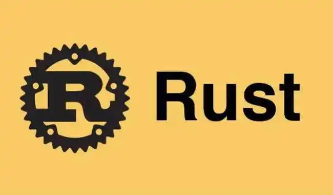

# Rust 学习笔记

- 基础知识
  - [一.语言基础](https://zhoubichuan.github.io/web-rust/base/engine/1.index.html)
  - [二.项目工程](https://zhoubichuan.github.io/web-rust/base/project/1.index.html)
  - [三.项目案例](https://zhoubichuan.github.io/web-rust/base/rust/1.index.html)
  - [四.Vue 3.x 基础](https://zhoubichuan.github.io/web-rust/base/vue3.x/1.index.html)
- 高级知识
  - [一.Vue 组件开发](https://zhoubichuan.github.io/web-rust/senior/component/1.index.html)
  - [二.TypeScript](https://zhoubichuan.github.io/web-rust/senior/typescript/1.index.html)
  - [三.构建部署](https://zhoubichuan.github.io/web-rust/senior/deploy/1.index.html)
- 源码知识
  - [一.Vue/cli2.x](https://zhoubichuan.github.io/web-rust/source/vue-cli2.x/1.index.html)
  - [二.Vue 2.x](https://zhoubichuan.github.io/web-rust/source/rust/1.index.html)
  - [三.Vue-Router3.x](https://zhoubichuan.github.io/web-rust/source/vue-router3.x/1.index.html)
  - [四.Vuex3.x](https://zhoubichuan.github.io/web-rust/source/vuex3.x/1.index.html)
- [相关资料](https://zhoubichuan.github.io/web-rust/source/vuex4.x/1.index.html)
